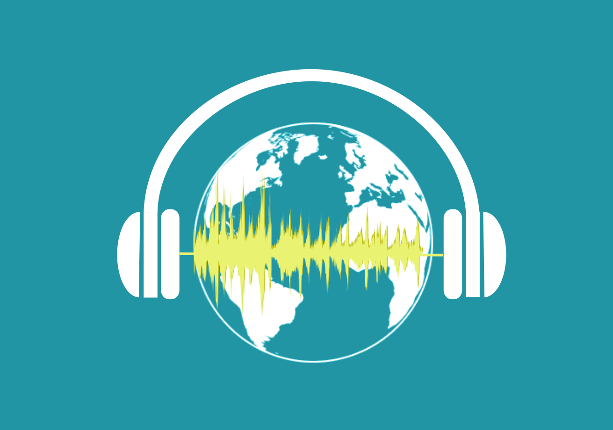

# yourdigitalmentorpodcast

Making stories about mentorship and career development

[About Your Digital Mentor Podcat](About Your Digital Mentor Podcast.md)      [Podcast story](Podcast story.md)     [Initiating your own podcast](Initiating a podcast.md)

# Standing on the shoulder of giants
The very popular metaphor that “One stands on the shoulders of giants” rings true in mentoring. It is also true that mentoring is a learned skill that one has to actively pursue and partake in. Through our learned experiences in various fields in science and public health, we have interacted with some phenomenal people across the globe, peers and mentors alike, who can share their experience and offer advice. We wish to make this expertise more accessible to a wider audience by creating a podcast. 

The goal of the Your Digital Mentor Podcast is to share knowledge and experiences, and to engage scientists and global health experts in topics that impact careers and professional skills development. The motto being “Pay it forward” the podcast uses digital media to amplify the voices of those who have walked the journey and want to share it for thebenefit of others.

This website is the sum of all the ideas, practical steps and processes, developed as a knowledge sharing platform to provide freely available resources for anyone who wants to start a podcast for global professional audiences. Having learnt from various sources on how to develop a podcast, we are sharing our experiences as a mentorship gesture to others and "paying it forward". We hope that it will be useful to you and you can tailor your podcast. We would like to make this a community project and invite anyone who would like to input into this work. Contact us on enquiries@yourdigimentor.net  

